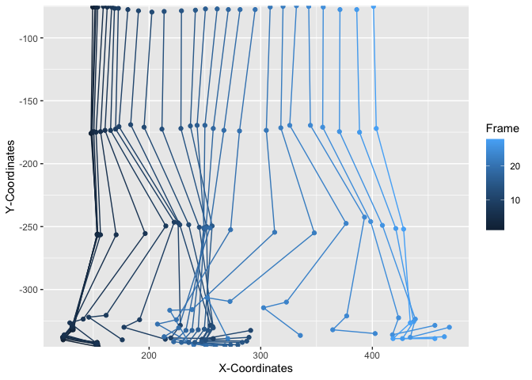
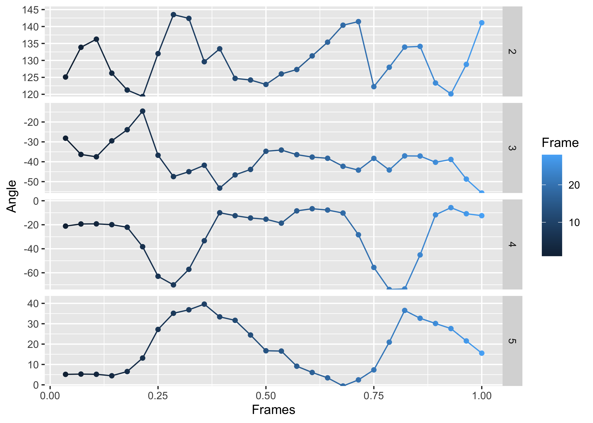
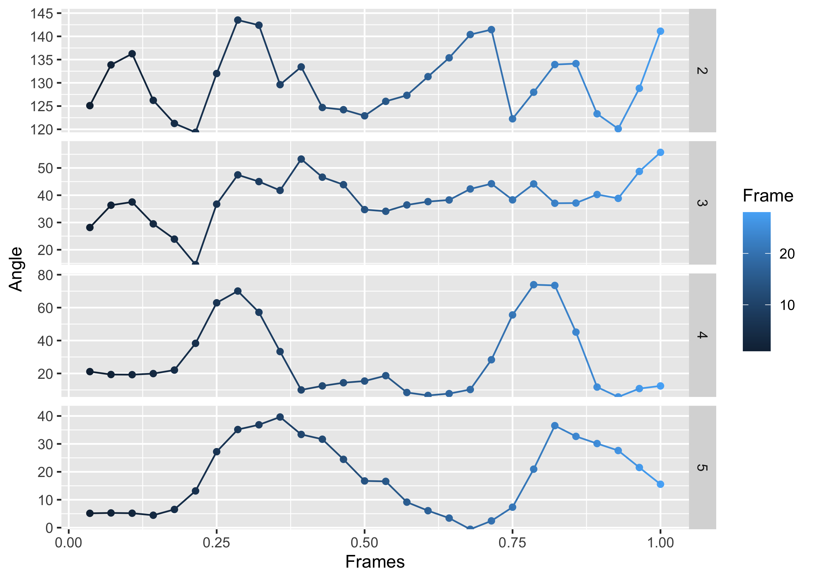
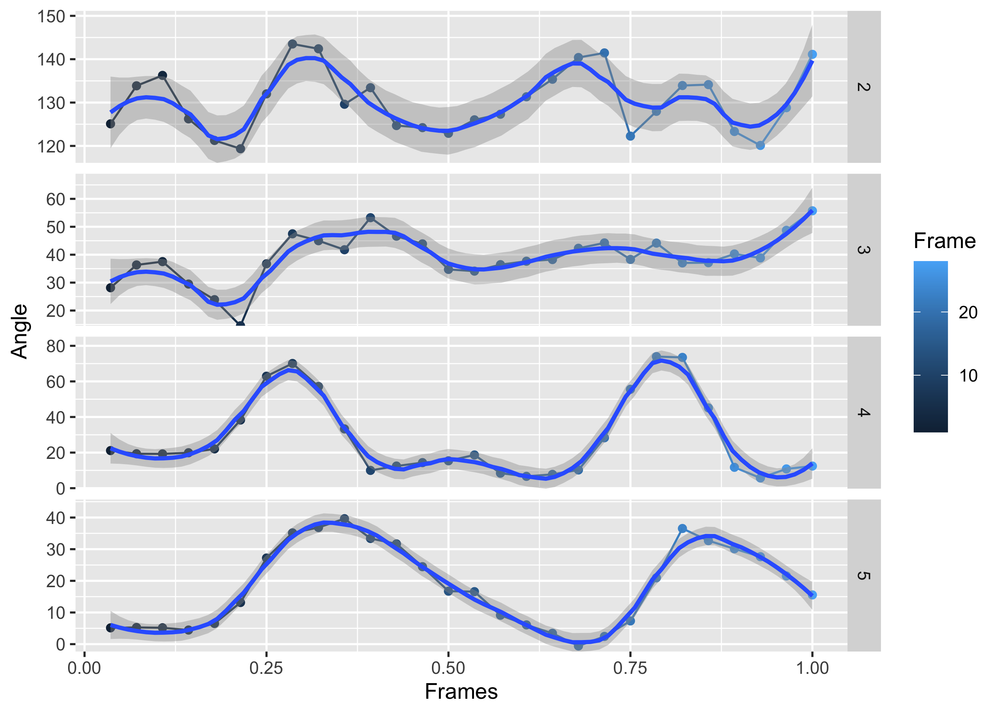
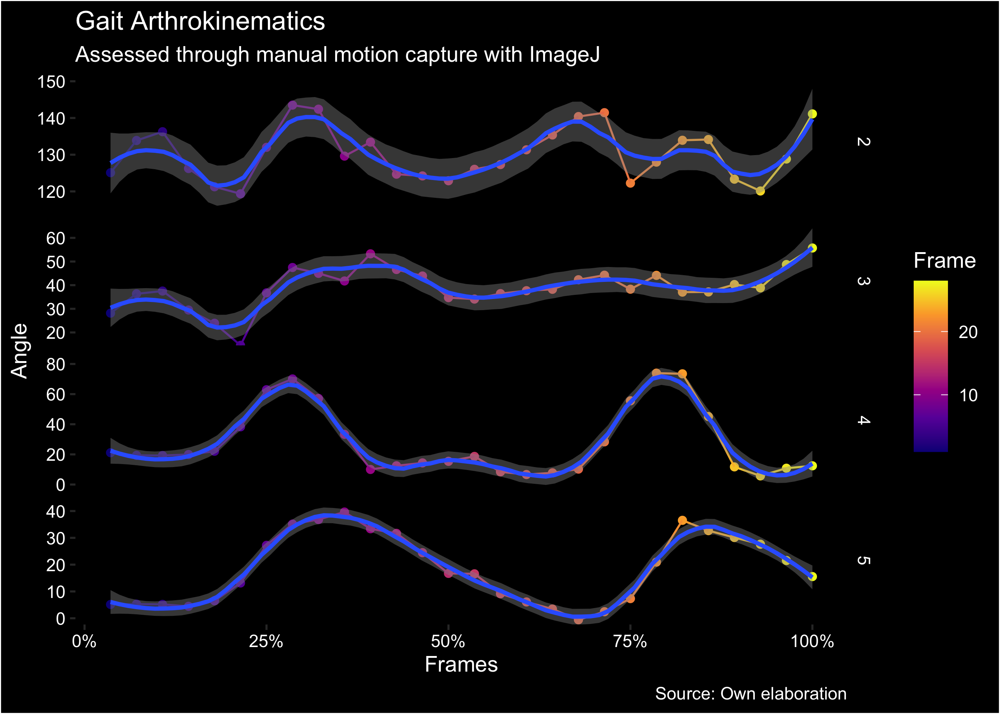

<!-- README.md is generated from README.Rmd. Please edit that file -->

# kinemov

<!-- badges: start -->

[](https://lifecycle.r-lib.org/articles/stages.html#experimental)
[](https://CRAN.R-project.org/package=kinemov)
[](https://github.com/matcasti/kinemov/actions/workflows/R-CMD-check.yaml)
[](https://app.codecov.io/gh/matcasti/kinemov?branch=master)
<!-- badges: end -->

The goal of kinemov is to provide a simple and easy to use interface to
visualize and analyze 2-dimensional motion capture data.

## Installation

You can install the development version of kinemov like so:

``` r
# install.packages("devtools")
devtools::install_github("matcasti/kinemov")
```

## Example

### Visualize motion

You can try using the example dataset `gait` this way:

``` r
library(kinemov)

plot_motion(
  data = gait, # Data containing our variables
  x = x_coord, # Variable with our X-Coordinates
  y = y_coord, # Variable with our Y-Coordinates
  frames = frame # Variable with our Frame IDs
) 
```



### Visualize arthrokinematics

You can also plot the degrees between joints in this way:

``` r
plot_degrees(
  data = gait, # Data containing our variables
  x = x_coord, # Variable with our X-Coordinates
  y = y_coord,  # Variable with our Y-Coordinates
  joint_ids = joint, # Variable with our Joint IDs
  frames = frame # Variable with our Frame IDs
)
```



However, you might see that some degrees are negative, this is because
not every angle is formed from the same side. For instance, see the knee
(ID = 4) and ankle (ID = 3) angles compared to the hip angles (ID = 5).
Given that the angle behind the knee and the ankle are on the right
side, the angles are shown negative. We can easily fix this by
leveraging the `inv_joint_angles` argument as follow:

``` r
plot_degrees(
  data = gait,
  x = x_coord,
  y = y_coord,
  joint_ids = joint,
  frames = frame,
  inv_joint_angles = c("3", "4") # Joint IDs to invert (negative to positive)
)
```



We can also add a smooth line by using the `smooth` argument and
specifyin one of `"gam"` or `"loess"` to determine which method to use
to draw a smooth line. We can do this as follow:

``` r
fig <- plot_degrees(
  data = gait,
  x = x_coord,
  y = y_coord,
  joint_ids = joint,
  frames = frame,
  inv_joint_angles = c("3", "4"),
  smooth = "loess", # Smooth method to use
  span = .3, # LOESS "smoothness" parameter
)

fig
#> `geom_smooth()` using formula = 'y ~ x'
```



And as it is a ggplot object, we can further customize the output object
by using other ggplot geoms like this:

``` r
library(ggplot2)
library(scales)

fig + 
  labs(title = "Gait Arthrokinematics",
       subtitle = "Assessed through manual motion capture with ImageJ",
       caption = "Source: Own elaboration") +
  scale_color_viridis_c(option = "C") + 
  scale_x_continuous(labels = label_percent()) + 
  theme(plot.background = element_rect(fill = "black"),
        panel.background = element_rect(fill = "black"),
        strip.background = element_rect(fill = "black"),
        strip.text = element_text(colour = "white"),
        legend.background = element_rect(fill = "black"),
        panel.grid = element_blank(),
        text = element_text(colour = "white"),
        axis.text = element_text(colour = "white"))
#> `geom_smooth()` using formula = 'y ~ x'
```



### Extracting information

And from the `plot_degrees()` function, you can also only extract the
degrees by specifying `plot = FALSE`:

``` r
out <- plot_degrees(gait, x_coord, y_coord, joint, frame, plot = FALSE)

subset(out, !is.na(angle)) |> head()
#>    joint frame x_coord y_coord    angle
#> 29     2     1   123.0   340.0 125.0958
#> 30     2     2   123.0   339.0 133.8656
#> 31     2     3   122.5   338.0 136.2633
#> 32     2     4   123.5   337.0 126.2360
#> 33     2     5   123.5   337.5 121.2637
#> 34     2     6   124.0   336.0 119.3529
```

One can further process the output data.frame to better describe the
angles for each joint and for each frame:

``` r
library(data.table)

out <- as.data.table(out)
out[i = !is.na(angle), 
    j = list(min = min(angle), 
             mean = mean(angle),
             median = median(angle),
             max = max(angle)) |> 
      lapply(round),
    by = joint]
#>    joint   min  mean median   max
#>    <int> <num> <num>  <num> <num>
#> 1:     2   119   130    129   144
#> 2:     3   -56   -39    -38   -15
#> 3:     4   -74   -28    -19    -6
#> 4:     5    -1    18     17    40
```
